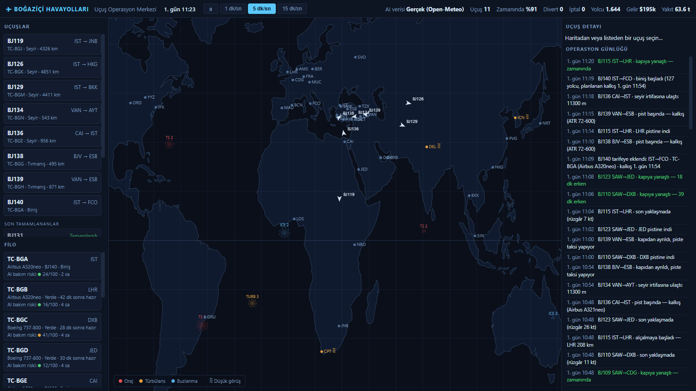
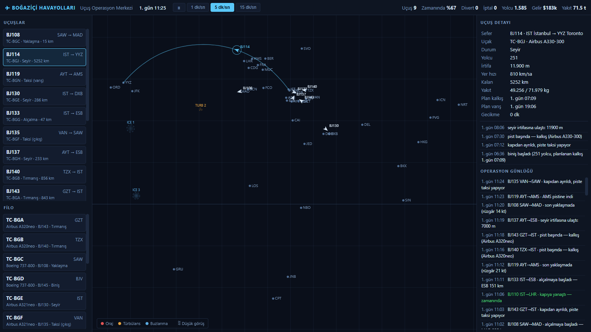
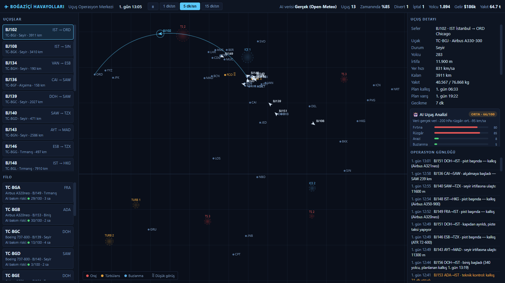

# Boğaziçi Havayolları — Uçuş Operasyon Merkezi Simülasyonu

Kurgusal bir havayolu şirketinin (BJ / "BOSPHORUS") tüm uçuş operasyonunu
gerçek zamanlı simüle eden, tarayıcıda çalışan bir uygulama. Harici bağımlılık
yoktur; saf HTML + CSS + JavaScript.

**🔗 Canlı demo: https://melihkalkan4.github.io/ucak-simulasyonu/**



*Seçili uçuş: büyük daire rotası, canlı telemetri ve olay geçmişi*



## Çalıştırma

- **En kolay:** `index.html` dosyasına çift tıklayın.
- veya bir sunucuyla: `python -m http.server 8123` → `http://localhost:8123`
- İpucu: `index.html?ff=300` gibi bir adresle simülasyonu 300 dakika ileri
  sarılmış olarak başlatabilirsiniz (tanıtım/test için).

## Ne simüle ediliyor?

### Filo (13 uçak, tipe göre performans)
ATR 72-600, A320neo, A321neo, 737-800, A330-300, 787-9, A350-900, 777-300ER.
Her tipin kendi seyir hızı, tavanı, tırmanma oranı, menzili, yakıt sarfiyatı,
koltuk kapasitesi ve turnaround süresi vardır. Turboproplar fırtınanın
üzerinden aşamaz, geniş gövdeler uzun hat uçar (İstanbul'dan JFK, Singapur,
São Paulo, Tokyo...).

### Uçuş yaşam döngüsü
Planlama → Biniş → Taksi → Kalkış → Tırmanış → Seyir → Alçalma →
(Bekleme paterni) → Yaklaşma → İniş → Taksi → Kapı. Yakıt planı gerçekçi
kurala göre hesaplanır: sefer yakıtı + %5 + alternatif meydan + 45 dk rezerv.

### Yolda karşılaşılan zorluklar
- **Hareket eden hava hücreleri:** oraj (TS), türbülans (TURB), buzlanma (ICE);
  şiddet 1–3. Uçak tavanı yetiyorsa üzerinden aşar, yetmiyorsa rota sapması
  yapar (gecikme + ekstra yakıt). Şiddetli türbülansta yaralanma riski.
- **Jet akımı:** ~45° enlemde doğuya esen rüzgâr; doğu yönlü uçuşlar hızlanır,
  batı yönlüler yavaşlar.
- **Havalimanı meteorolojisi:** sis/düşük görüş (CAT III olmayan meydanlarda
  kalkış bekletir, inişte bekleme paternine sokar), kuvvetli rüzgârda
  **pas geçme** olasılığı artar.
- **Bekleme ve divert:** hava düzelmezse veya yakıt asgariye inerse en yakın
  uygun meydana yönlendirme; MINIMUM FUEL / MAYDAY FUEL prosedürleri.
- **Teknik/operasyonel olaylar:** kalkış öncesi teknik rötar ve iptal, kuş
  çarpması (geri dönüş kararı), motor arızası (PAN PAN), kabin basıncı kaybı
  (MAYDAY + acil alçalma), tıbbi acil durum (en yakın meydana iniş), hidrolik
  uyarısı (varışta bakım). Olay yaşayan uçak yerde +90 dk bakıma alınır.

### 🤖 AI Uçuş Danışmanı (gerçek verilerle)
Her uçuş tarifeye eklendiğinde AI dispatch sistemi **gerçek dünya verisiyle**
rota analizi yapar ve önerilerini otomatik uygular:



- **GIS arazi profili:** Rota (ve kuzey/güney varyantları) Copernicus DEM 90 m
  yükseklik modeliyle örneklenir; MSA (asgari emniyet irtifası) hesaplanır ve
  uçağın **tek-motor drift-down tavanıyla** karşılaştırılır. Detay panelinde
  arazi kesiti, seyir irtifası ve tek-motor tavanı çizgileriyle görselleştirilir.
- **Gerçek meteoroloji (Open-Meteo):** Seyir seviyesine karşılık gelen basınç
  seviyesindeki (200–500 hPa) gerçek rüzgârlar → karşı/arka rüzgâr bileşeni,
  blok süre etkisi ve **irtifa değişikliği önerisi**; CAPE (konvektif enerji) →
  oraj riski; donma seviyesi → turboprop buzlanma bandı; varış meydanının
  gerçek görüş/hamle rüzgârı/yağış tahmini → CAT III / divert riski.
- **Rota optimizasyonu:** Direkt rota ile ±4° enlem varyantları rüzgâr, fırtına
  hücresi kesişimi ve arazi cezalarıyla puanlanır; kazanç varsa uçuş **gerçekten
  önerilen varyanttan uçar** (haritada "AI WPT" ara noktası görünür).
- **Otomatik uygulanan öneriler:** ekstra yakıt yüklemesi, alternatif meydan
  ataması (bekleme paterninden divert'te kullanılır), seyir irtifası değişikliği.
- **Öngörülü bakım:** Uçak başına kullanım saati + olay geçmişinden bakım risk
  skoru (filo panelinde canlı); skor 70'i aşan uçak üssüne döndüğünde otomatik
  planlı kontrole alınır.
- **Risk raporu:** 6 kategoride skor (fırtına, rüzgâr, arazi, buzlanma, varış,
  uçak) + genel risk; bulgular ve öneriler uçuş detayında listelenir.
- İnternet yoksa danışman **sentetik modele** düşer; üst barda veri kaynağı
  (Gerçek/Sentetik) gösterilir. API istekleri hız limitine takılmamak için
  seri kuyruktan akar, başarısız analiz bir kez yeniden denenir.

### Şirket katmanı
Uçaklar otomatik tarifelenir (üsten çık, üsse dön), turnaround süreleri
işler; üst barda tamamlanan uçuş, zamanındalık (%), divert, iptal, taşınan
yolcu, gelir ve yakıt tüketimi izlenir.

## Arayüz
- **Harita:** uçaklar (rotaya dönük üçgen), hava hücreleri, havalimanları
  (≋ = düşük görüş). Uçağa tıklayınca rota ve detay paneli açılır.
- **Sol panel:** aktif uçuşlar ve filo durumu.
- **Sağ panel:** seçili uçuşun detayı (irtifa, hız, yakıt, gecikme, olaylar)
  ve tüm şirketin operasyon günlüğü.
- **Hız kontrolü:** ⏸ / 1 / 5 / 15 simülasyon dakikası ÷ saniye.

## Dosya yapısı
```
index.html        arayüz iskeleti
css/style.css     koyu "operasyon merkezi" teması
js/data.js        uçak tipleri (tek-motor tavanı dahil), 40 havalimanı, filo
js/geo.js         büyük daire matematiği, yol örnekleme, jet akımı modeli
js/geodata.js     gerçek veri istemcisi: Open-Meteo hava + Copernicus DEM
js/weather.js     dinamik hava hücreleri + meydan meteorolojisi (sim)
js/flight.js      uçuş faz makinesi, yakıt, olaylar, divert, AI via desteği
js/advisor.js     AI uçuş danışmanı: risk analizi, rota/irtifa/yakıt önerisi
js/sim.js         simülasyon saati, tarifeleme, istatistikler
js/ui.js          canvas harita + paneller + AI rapor bloğu
js/main.js        başlatma ve ana döngü
```

## Veri kaynakları
- [Open-Meteo Forecast API](https://open-meteo.com/) — basınç seviyesi
  rüzgârları, CAPE, donma seviyesi, meydan görüş/rüzgâr/yağış (anahtarsız)
- [Open-Meteo Elevation API](https://open-meteo.com/en/docs/elevation-api) —
  Copernicus GLO-90 sayısal yükseklik modeli (GIS arazi profilleri)
